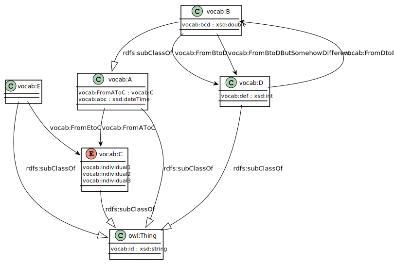
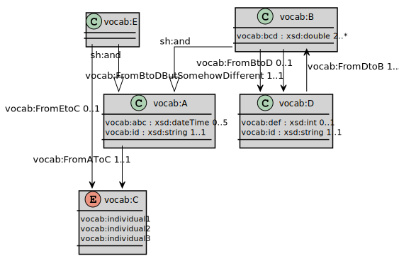

= ExampleProfile

== Description
This profile is test data to see whether de transformer works correctly.

== Vocabulary
=== Diagram

//This is just an example, feel free to be more creative. The result should be a uml class diagram or other visual representation of an ontology, if a UML-class diagram is used, it is preferred that it uses a visual style (line styles- straight versus curved-, colors etc) to the constraint diagram. In that case, make sure to label the inheritance arrows with "rdfs:subCLassOf".

=== Classes

==== vocab:A

[cols="1,1"]
|===
|definition 
|This is a super class

|subClassOf
|

|labels
|Aa (nl)
|=== 

==== vocab:B

[cols="1,1"]
|===
|definition 
|This is a sub-class

|subClassOf
|vocab:A

|labels
|Bb (nl)
|=== 

==== vocab:C

[cols="1,1"]
|===
|definition 
|This is a class with named elements

|subClassOf
|

|labels
|Cc (nl)
|=== 

==== vocab:D

[cols="1,1"]
|===
|definition 
|This is yet another class

|subClassOf
|

|labels
|Dd (nl)
|=== 

==== vocab:E

[cols="1,1"]
|===
|definition 
|This is another sub-class of A

|subClassOf
|vocab:A

|labels
|Ee (nl)
|=== 

=== Properties

==== vocab:FromAToC

[cols="1,1"]
|===
|definition 
|

|domain
|vocab:A

|range
|vocab:C

|labels
|VanANaarC (nl)
|=== 

==== vocab:FromBToD

[cols="1,1"]
|===
|definition 
|Association from B to D

|domain
|vocab:B

|range
|vocab:D

|labels
|VanBNaarD (nl)
|=== 

==== vocab:FromBtoDButSomehowDifferent

[cols="1,1"]
|===
|definition 
|Association from B to D but somehow different

|domain
|vocab:B

|range
|vocab:D

|labels
|VanBnaarDMaarNetAnders (nl)
|=== 

==== vocab:FromDtoB

[cols="1,1"]
|===
|definition 
|Association from D to B

|domain
|vocab:D

|range
|vocab:B

|labels
|VanDnaarB (nl)
|=== 

==== vocab:FromEtoC

[cols="1,1"]
|===
|definition 
|Association from D to B

|domain
|vocab:E

|range
|vocab:C

|labels
|
|=== 

==== vocab:abc

[cols="1,1"]
|===
|definition 
|

|domain
|vocab:A

|range
|xsd:dateTime

|labels
|
|=== 

==== vocab:bcd

[cols="1,1"]
|===
|definition 
|

|domain
|vocab:B

|range
|xsd:double

|labels
|
|=== 

==== vocab:def

[cols="1,1"]
|===
|definition 
|

|domain
|vocab:D

|range
|xsd:integer

|labels
|
|=== 

==== vocab:id

[cols="1,1"]
|===
|definition 
|

|domain
|owl:Thing

|range
|xsd:integer

|labels
|
|=== 

=== Individuals

==== vocab:individual1

[cols="1,1"]
|===
|definition 
|

|type (instance of)
|vocab:C

|labels
|individu1 (nl)
|=== 

==== vocab:individual2

[cols="1,1"]
|===
|definition 
|

|type (instance of)
|vocab:C

|labels
|vocab:individu2 (nl)
|=== 

==== vocab:individual3

[cols="1,1"]
|===
|definition 
|

|type (instance of)
|vocab:C

|labels
|individu3 (nl)
|=== 

== Constraint

=== Diagram

//This is just an example, feel free to be more creative. The result should be a uml class diagram or other visual representation of a shacl shape graph, if a UML-class diagram is used, it is preferred that it uses a visual style (line styles- straight versus curved-, colors etc) to the constraint diagram. In that case, make sure to label the inheritance arrows with "sh:and".

=== Node Shapes

==== shape:AShape

[cols="1,1,1"]
|===
| sh:targetClass 
2.+| vocab:A 

| sh: property 
2.+| shape:idShape

.4+| sh: property 
| sh:path 
| vocab:FromAtoC

| sh:minCount 
| 1 

| sh:maxCount 
| 1  

| sh:node
| shape:CShape

.4+| sh: property 
| sh:path 
| vocab:abc

| sh:minCount 
| 0 

| sh:maxCount 
| 5  

| sh:datatype
| xsd:dateTime

|===

=== Property Shapes

==== shape:idShape

[cols="1,1"]
|===
| sh:path 
| vocab:id 

| sh:minCount 
| 1 

| sh:maxCount 
| 1  

|sh:datatype
|xsd:string
|===