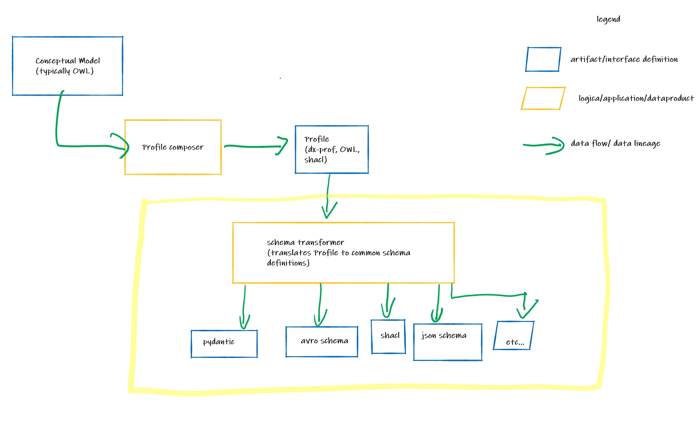
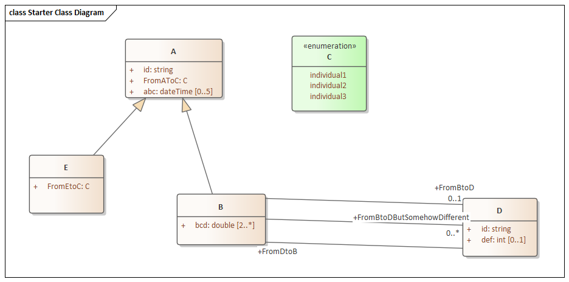

# Schema generator

Facilitates automatically generating schema's (Avro, Json) from profiles  ([dx-prof](https://www.w3.org/TR/dx-prof/)/CIM -501 using rdfs/owl+shacl).

## Architecture of the generators

## Vocabulary and Constraints used to define a profile

To define the vocabulary of the profile, the following constructs will be used for the transformation:

| Vocabulary |
| --- |
| [owl:Class](http://www.w3.org/2002/07/owl#Class) |
| [owl:DatatypeProperty](http://www.w3.org/2002/07/owl#DatatypeProperty) |
| [owl:ObjectProperty](http://www.w3.org/2002/07/owl#ObjectProperty) |
| [rdf:type](http://www.w3.org/1999/02/22-rdf-syntax-ns#type) |
| [rdfs:comment](http://www.w3.org/2000/01/rdf-schema#comment) |
| [rdfs:range](http://www.w3.org/2000/01/rdf-schema#range) |
| [rdfs:domain](http://www.w3.org/2000/01/rdf-schema#domain) |
| [rdfs:label](http://www.w3.org/2000/01/rdf-schema#label) |
| [rdfs:subClassOf](http://www.w3.org/2000/01/rdf-schema#subClassOf) |
| [rdfs:subPropertyOf](http://www.w3.org/2000/01/rdf-schema#subPropertyOf) |

To define the constraints, the following constructs will be used for the transformation:

| Constraints |
| --- | 
| [sh:NodeShape](http://www.w3.org/ns/shacl#NodeShape) | 
| [sh:targetClass](http://www.w3.org/ns/shacl#targetClass) | 
| [sh:datatype](http://www.w3.org/ns/shacl#datatype) | 
| [sh:property](http://www.w3.org/ns/shacl#property) | 
| [sh:minCount](http://www.w3.org/ns/shacl#minCount) | 
| [sh:maxCount](http://www.w3.org/ns/shacl#maxCount) | 
| [sh:path](http://www.w3.org/ns/shacl#path) | 
| [sh:in](http://www.w3.org/ns/shacl#in) | 
| [sh:node](http://www.w3.org/ns/shacl#node) |

## Mapping specifications from rdfs/owl+shacl to schema's

### example profile

The purpose of the Example Profile is to provide a common starting point to transf to different schema technologies. You will se that different schema technologies have support different levels of expressiveness, and some allow for richer data structures than others. Two examples to illustrate this:

- Some schema definitions provide structures to model sub-typing or inheritance (like UML, XSD, JSON Schema), others don't (like Apache Avro and Shacl). There are ways to transform a profile in such a way that the structural definitions do not get lost (even if the taxonomical 'knowledge' is no longer represented in the schema).
- There are many situations in which we need to model a relationship between 2 objects of the same type. A Schema like Apache Avro does not support this. 

The challenge in schema generation is to recognize the strengths and weaknesses of each of these schema's and generate an artifact that represents the intent of the profile without introducing new definitions or constructs. The example profile is meant to 'put the finger on the sore spot' for frequently used schema definitions so that we can properly explore the best possible transformation.

### Apache Avro

#### Introduction
Apache Avro schema is a schema definition that is primarily used for modelling events on the Apache Kafka message queue.

#### Technical considerations
Apache Avro supports
- objects
- primitive attributes
- relationships between objects
- sub type relations
    - the schema itself doesn't understand this, but the mapping can be configured such that it displays the correct label for the relationship 
- limited cardinality (0,1,*)
- tree structure
- enumerations
- type unions
- documentation within the schema 

Apache Avro does not support

- inheritance/subtypes
- cardinality beyond 0,1, *
- graph structure
- Relation 'loops' (from A to B to C back to A or any variant)
    - Relations between objects of the same type are a special case of this limitation

Additional requirements for automatic generation:
- requires definition of a Root Object

#### Notes
Apache Avro requires the definition of a Root Object. In the example profile, "B" was taken as the root object. Because Avro provides a tree structure and does not support relation 'loops', it means "E" is ignored in this schema. 

#### Mapping table

| Some schema | Profile | notes |
|:---|:---|:---|
| record | [sh:NodeShape](http://www.w3.org/ns/shacl#NodeShape) | |
| name of the record | [sh:targetClass](http://www.w3.org/ns/shacl#targetClass) | | 
| field | [sh:property](http://www.w3.org/ns/shacl#property) | |
| type (field) | [sh:node](http://www.w3.org/ns/shacl#node) | if type is complex |
| type (field) | [sh:datatype](http://www.w3.org/ns/shacl#datatype) | |
|type= union ( null, * | [sh:minCount](http://www.w3.org/ns/shacl#minCount) | if <1 otherwise not supported|
| type = array | [sh:maxCount](http://www.w3.org/ns/shacl#maxCount) | if maxCount > 1 only supports cardinality of  *|
| name of field| [sh:path](http://www.w3.org/ns/shacl#path) | |
| enum | [sh:in](http://www.w3.org/ns/shacl#in) | |
| add fields | [rdfs:subClassOf](http://www.w3.org/2000/01/rdf-schema#subClassOf) | Apply all sh:properties   of shapes describing super classes|
| modify fields | [rdfs:subPropertyOf](http://www.w3.org/2000/01/rdf-schema#subPropertyOf) | replace super property by sub-property |

#### Primitive mapping

| avro schema primitive | XSD Primitive | notes |
|:---|:---|:---|
| string | [xsd:string]() | |
| boolean | [xsd:boolean]() | |
| bytes | [xsd:decimal]() | "logicalType": "decimal"|
| float | [xsd:float]() | |
| double | [xsd:double]() | |
| fixed | [xsd:duration]() | "logicalType": "duration" |
| string ([conforming to iso 8601](https://en.wikipedia.org/wiki/ISO_8601))| [xsd:dateTime]() | it is possible to map these   to avro int/long with logical type   "timestamp-millis" or  "timestamp-micros". we have found   this leads to much confusion among developers,  so we recommend mapping to iso format (string) |
|| [xsd:time]() | |
|| [xsd:date]() | |
|| [xsd:anyURI]() | |

The Avro schema that is generated according to these rules from the example profile can be found [here](./ExampleModels/ExampleAvroSchema.avsc).

### SQL 

#### Introduction
SQL is actually a query language, but defining the structures of a relational data base is embedded within the query language. Relational databases are probably still the most common approach to storing and retrieving data.

#### Technical considerations
SQL supports
- objects
- inheritance 
- primitive attributes 
- relationships between objects
- sub-relations
- limited cardinality (0,1,*)
- graph structure
- enumerations

SQL does not support
- cardinality beyond 0,1,*

Additional requirements for automatic generation:
- requires explicit identification of primary keys (which is good practice anyway ;-) ) 

#### Mapping table

| SQL | Profile | notes |
|:---|:---|:---|
| table | [sh:NodeShape](http://www.w3.org/ns/shacl#NodeShape) | |
| name of the table |[sh:targetClass](http://www.w3.org/ns/shacl#targetClass)||
| column | [sh:property](http://www.w3.org/ns/shacl#property) | |
|| [sh:node](http://www.w3.org/ns/shacl#node) | create foreign key constraint|
| datatype| [sh:datatype](http://www.w3.org/ns/shacl#datatype) | |
|| [sh:minCount](http://www.w3.org/ns/shacl#minCount) | |
|| [sh:maxCount](http://www.w3.org/ns/shacl#maxCount) | if maxCount > 1 do not create column instead   create link table with columns 'domain' and 'range |
| name of the column| [sh:path](http://www.w3.org/ns/shacl#path) | |
|| [sh:in](http://www.w3.org/ns/shacl#in) | create new table with 1 column   and use elements as primary keys |
|| [rdfs:subClassOf](http://www.w3.org/2000/01/rdf-schema#subClassOf) | for super-class, create table as union of subclasses |
|| [rdfs:subPropertyOf](http://www.w3.org/2000/01/rdf-schema#subPropertyOf) ||

#### PrimitiveMapping

| SQL  | XSD Primitive | notes |
|:---|:---|:---|
| VARCHAR()| [xsd:string](http://www.w3.org/ns/shacl#NodeShape) | |
|BOOLEAN| [xsd:boolean](http://www.w3.org/ns/shacl#property) | |
| DECIMAL()| [xsd:decimal](http://www.w3.org/ns/shacl#node) ||
|| [xsd:float](http://www.w3.org/ns/shacl#datatype) | |
| DOUBLE()| [xsd:double](http://www.w3.org/ns/shacl#minCount) | |
|| [xsd:duration](http://www.w3.org/ns/shacl#maxCount) | |
| DATETIME() | [xsd:dateTime](http://www.w3.org/ns/shacl#path) | |
|| [xsd:time](http://www.w3.org/ns/shacl#in) | |
|| [xsd:date](http://www.w3.org/2000/01/rdf-schema#subClassOf) | |
|| [xsd:anyURI](http://www.w3.org/2000/01/rdf-schema#subPropertyOf) | |

### OpenAPI/json schema

#### Introduction
Apache Avro schema is a schema definition that is primarily used for modelling events on the Apache Kafka message queue.

#### Technical considerations
OpenAPI/JSON Schema supports

- objects
- inheritance/subtypes
- primitive attributes
- relationships between objects
- cardinality
- tree structure
- enumerations
- type unions

OpenAPI/JSON Schema does not support

- sub-relations
    - because inheritance is approach structurally, though the allOf array, the super-relation has to be used 
- graph structure
- out of the box type-validation for data instances 
    - this can be circumvented/hacked by using the @type keyword borrowed from JSON-LD. 
- documentation within the schema     

Additional requirements for automatic generation:
- Supports definition of a Root Object (not required)

#### Mapping table

| OpenAPI json schema | Profile | notes |
|:---|:---|:---|
| Object| [sh:NodeShape](http://www.w3.org/ns/shacl#NodeShape) | |
|| [sh:targetClass](http://www.w3.org/ns/shacl#targetClass) | |
| properties | [sh:property](http://www.w3.org/ns/shacl#property) | |
| if type is complex | [sh:node](http://www.w3.org/ns/shacl#node) ||
| if type is primitive| [sh:datatype](http://www.w3.org/ns/shacl#datatype) | |
| minItems | [sh:minCount](http://www.w3.org/ns/shacl#minCount) | |
| maxItems | [sh:maxCount](http://www.w3.org/ns/shacl#maxCount) | |
| name of the property| [sh:path](http://www.w3.org/ns/shacl#path) | |
| enum| [sh:in](http://www.w3.org/ns/shacl#in) | |
| allOf| [rdfs:subClassOf](http://www.w3.org/2000/01/rdf-schema#subClassOf) | |
| not supported | [rdfs:subPropertyOf](http://www.w3.org/2000/01/rdf-schema#subPropertyOf) | the way allOf validates does not allow    us to replace the super property by the sub-property |
| anyOf |  | if >1 sh:node specified use  anyOf to list all target types|

#### Primitive mapping

| Some schema primitive | XSD Primitive | notes |
|:---|:---|:---|
| string | [xsd:string](http://www.w3.org/ns/shacl#NodeShape) | |
| boolean | [xsd:boolean](http://www.w3.org/ns/shacl#property) | |
| number | [xsd:decimal](http://www.w3.org/ns/shacl#node) ||
| number | [xsd:float](http://www.w3.org/ns/shacl#datatype) | |
| number | [xsd:double](http://www.w3.org/ns/shacl#minCount) | |
| string | [xsd:duration](http://www.w3.org/ns/shacl#maxCount) | |
| string | [xsd:dateTime](http://www.w3.org/ns/shacl#path) | |
| string | [xsd:time](http://www.w3.org/ns/shacl#in) | |
| string | [xsd:date](http://www.w3.org/2000/01/rdf-schema#subClassOf) | |
| string | [xsd:anyURI](http://www.w3.org/2000/01/rdf-schema#subPropertyOf) | |

The JSON-schema that is generated according to these rules from the example profile can be found [here](./ExampleModels/ExampleJsonSchema.json).

### Generic Mapping Table

use these table templates to define a mapping for other schema's. feel free to augment where this makes sense

#### Mapping table

| Some schema | Profile | notes |
|:---|:---|:---|
|| [sh:NodeShape](http://www.w3.org/ns/shacl#NodeShape) | |
||[sh:targetClass](http://www.w3.org/ns/shacl#targetClass)||
|| [sh:property](http://www.w3.org/ns/shacl#property) | |
|| [sh:node](http://www.w3.org/ns/shacl#node) ||
|| [sh:datatype](http://www.w3.org/ns/shacl#datatype) | |
|| [sh:minCount](http://www.w3.org/ns/shacl#minCount) | |
|| [sh:maxCount](http://www.w3.org/ns/shacl#maxCount) | |
|| [sh:path](http://www.w3.org/ns/shacl#path) | |
|| [sh:in](http://www.w3.org/ns/shacl#in) | |
|| [rdfs:subClassOf](http://www.w3.org/2000/01/rdf-schema#subClassOf) | |
|| [rdfs:subPropertyOf](http://www.w3.org/2000/01/rdf-schema#subPropertyOf) | |

#### PrimitiveMapping

| Some schema primitive | XSD Primitive | notes |
|:---|:---|:---|
|| [xsd:string](http://www.w3.org/ns/shacl#NodeShape) | |
|| [xsd:boolean](http://www.w3.org/ns/shacl#property) | |
|| [xsd:decimal](http://www.w3.org/ns/shacl#node) ||
|| [xsd:float](http://www.w3.org/ns/shacl#datatype) | |
|| [xsd:double](http://www.w3.org/ns/shacl#minCount) | |
|| [xsd:duration](http://www.w3.org/ns/shacl#maxCount) | |
|| [xsd:dateTime](http://www.w3.org/ns/shacl#path) | |
|| [xsd:time](http://www.w3.org/ns/shacl#in) | |
|| [xsd:date](http://www.w3.org/2000/01/rdf-schema#subClassOf) | |
|| [xsd:anyURI](http://www.w3.org/2000/01/rdf-schema#subPropertyOf) | |